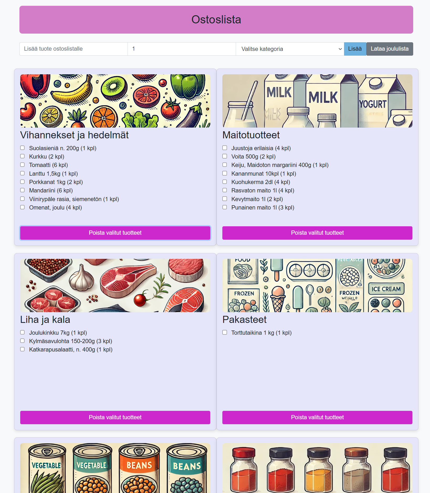
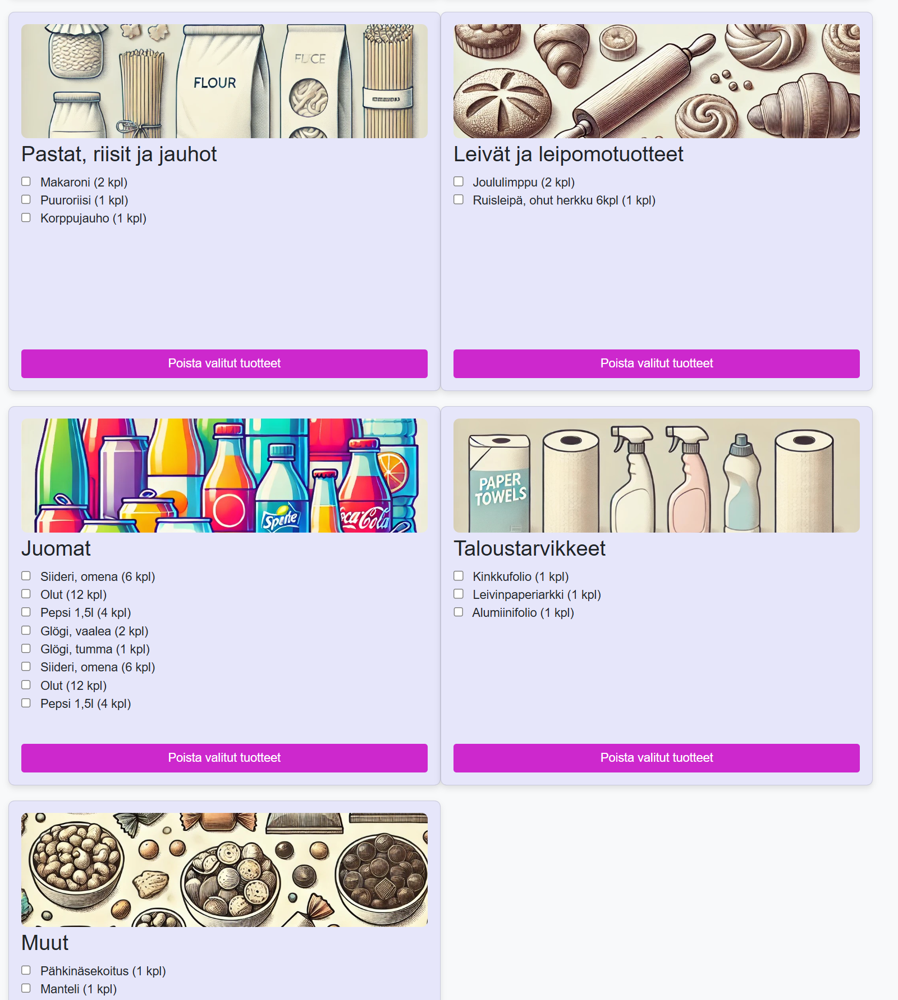

# Projektin nimi
Ostoslista

## Linkki sovellukseen:
Sovelluksen voi avata tästä linkistä: 
GitHub: [Ostoslista](https://cottiz.github.io/Projekti3)
Netlify: [Ostoslista](https://lucky-otter-04c574.netlify.app/)

## Työntekeminen
Projekti valmistui noin 25 tunnissa. Työstin projektia itsenäisesti hyödyntäen osittain tekoälyä. 

## Sisällysluettelo:

- [Sovelluksen idea](#sovelluksen-idea)
- [Kuvakaappaukset](#kuvakaappaukset)
- [Teknologiat](#teknologiat)
- [Asennus ja käynnistys](#asennus-ja-käynnistys)
- [Toteutustapa](#toteutustapa)
- [Projektin tila](#projektin-tila)
- [Lähteet](#lähteet)
- [Lisenssi](#lisenssi)

## Sovelluksen idea

Ostoslista on sovellus, johon voi lisätä tuotteita kategorioittain. Sovellus helpottaa kaupassa käyntiä jakamalla ostokset selkeisiin kategorioihin. Lisäksi siihen voi ladata joulun erikoisostoslistan JSON-tiedostosta yhdellä napin painalluksella. Näin sovellus vastaa omiin ja puolisoni tarpeisiin, ja mahdollistaa ostosten tekemisen nopeasti ja järjestelmällisesti.

## Kuvakaappaukset
Tässä kuvakaappaus sovelluksesta: 

## Teknologiat
Projektissa käytin seuraavia teknologioita:
- HTML: sivuston rakenteen toteuttaminen
- Bootstrap ja CSS: Visuaalisen ulkoasun ja tyylin luominen
- JavaScript: Tietojen haku JSON-tiedostosta ja toiminnallisuuksien toteutus.
- DALL-E: kuvien luominen

## Asennus ja käynnistys
1. Lataa tai kloonaa repository
2. Suorita sovellus Live Serverin kautta

## Toteutustapa
- Tuotteen lisääminen ja poistaminen: Tuotteita voi lisätä ja poistaa yksinkertaisilla napin painalluksilla.
- Kategorioiden hallinta: Tuotteet lisätään kategorioihin, mikä helpottaa ostosten tekemistä.
- Kuvien piilotus ja näyttö: Käyttäjä voi piilottaa tai näyttää kategorian kuvan kategoriaotsikkoa klikkaamalla.
- JSON-tiedoston lataaminen: Sovellus voi ladata esimerkkituotteita JSON-tiedostosta.
- Tietojen tallennus: Käyttäjän lisäämät tuotteet tallentuvat localStorageen, mikä säilyttää tiedot sivun päivitysten välillä.

## Projektin tila
Sovellus on valmis perusversio. Mahdollisia lisäominaisuuksia versioon 2:
- Kaikkien ostoslistojen tyhjennys: Napin painalluksella kaikki tuotteet tyhjennetään ja localStorage tyhjenee.
- Teemalliset ostoslistat JSON-tiedostoista: Erilaisia teemalistoja, kuten kesän grillijuhlat, tex-mex lista jne., jotka voi ladata tarpeen mukaan.

## Lähteet
Projektissa käytetyt lähteet ja apuvälineet:
- ChatGPT ja Github Copilot: Käytin tekoälytyökaluja ongelmanratkaisussa ja koodin tarkistuksessa. 
- [Bootstrap](https://getbootstrap.com/docs/5.3/examples/) - ideoiden hakuun ja tarkistamiseen
- Opettajan materiaalit Canvasissa

## Lisenssi
MIT lisenssi @ [Cottiz]
